# Project-exercise4 
# AdvancedProgrammingProject-exercise-4 📝

This is the fourth task out of a full google drive clone project.

## Key functionalities 📂

- User Accounts: Create a new user with an email, password, and profile image. Includes a login system to verify users.

- File & Folder Management: Create files with content or folders to stay organized. 

- Permissions Control: Share your files with other users. You can give "read", "write" or owner access, see who has permission, and change or delete those permissions whenever you want.

- File Operations: Full support for editing file content (PATCH) and deleting files or folders you don't need anymore.

- Search System: find what you're looking for by searching for a query. It checks both the names of the files and the text inside them.

- The site suppports 2 languages - Hebrew and English

- The site supports dark and light modes

- The site supports image uploading and storing 

- The site support "starred" feature to mark files 

## Setup 🛠️

1. Clone the repository - https://github.com/Ariel2001a/Project-exercise1/tree/Ex4

      - each task has its own branch - EX1, EX2, EX3...

2. Make sure u have c++17 compiler

3. 
     * run the servers and react - docker compose up --build

     *  go to http://localhost:3000/home

Dependencies

- c++17 standard library
 
## Run example 🏃‍♂️

                                              
##                                           create first user

 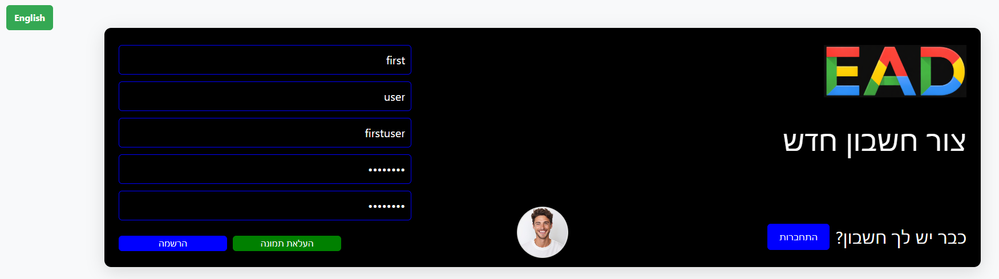 

 password must contain at least 8 characters including english letters and numbers

 username must be only letters and numbers (no @ , . /)

 first and last names must be in english

##                                           create second user

                                            
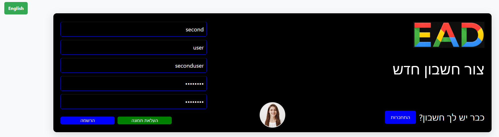         

##                                           login first user in hebrew

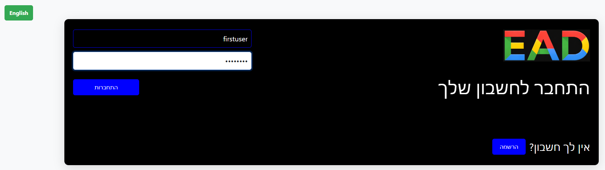 

- logged in with only username

##                                           login second user in english

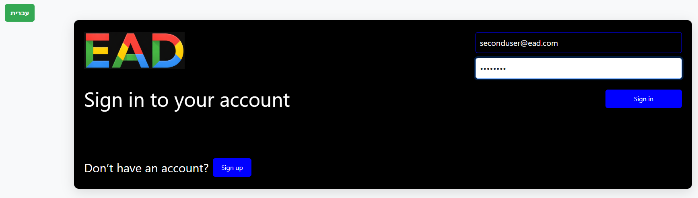 

- logged in with full mail - (username@ead.com)

##                                           first user in light mode + hebrew 

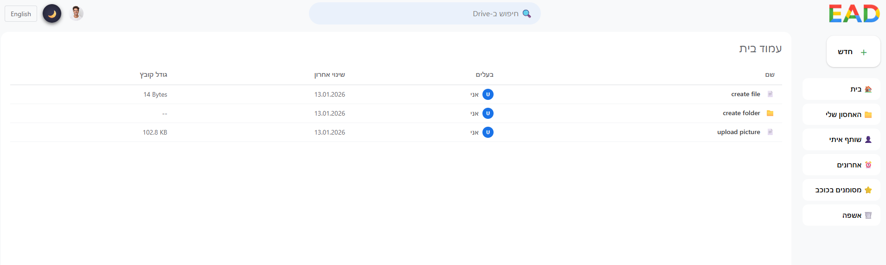 

##                                           second user homepage dark mode + english

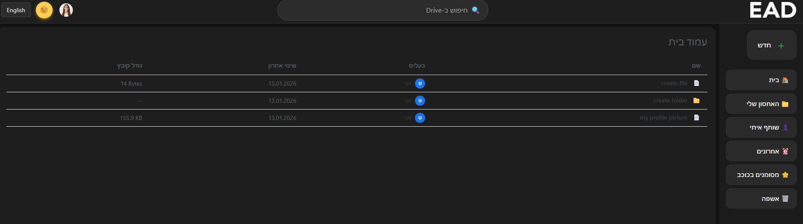 

##                                           create item form

 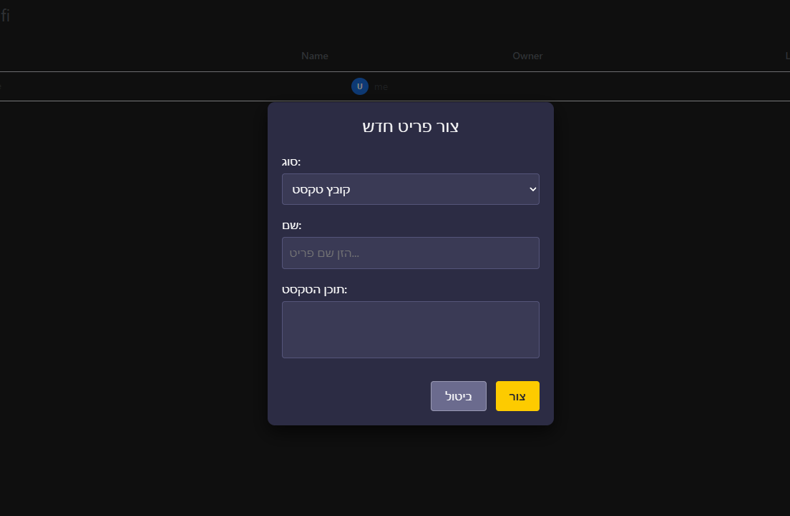 

 - here you can create file/folder/picture

 ##                                           share item form

 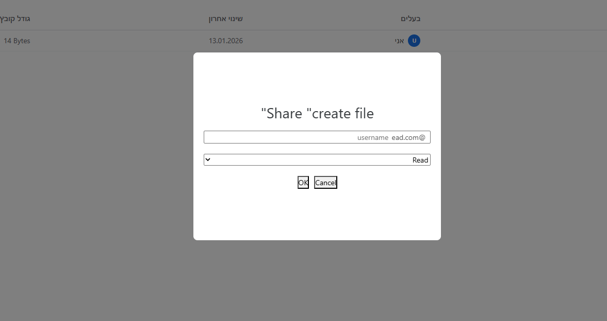 

 - here you can share file/folder/picture
 - you can choose what type of permission to give

 ##                                           starred file

 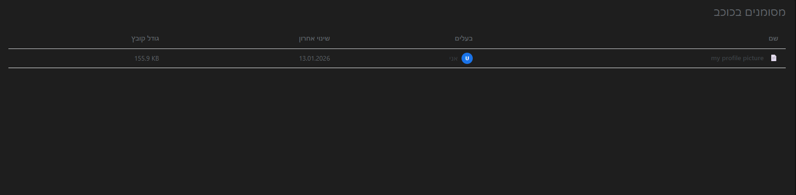 

 ##                                           recent files

 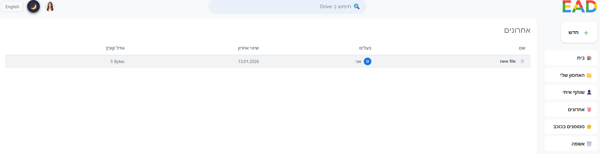 

 - here you can see the files you have created in the past week

 ##                                           searching

 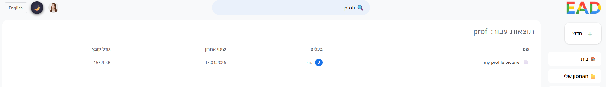 

 - here you can search among your files

##                                           trash bin page

 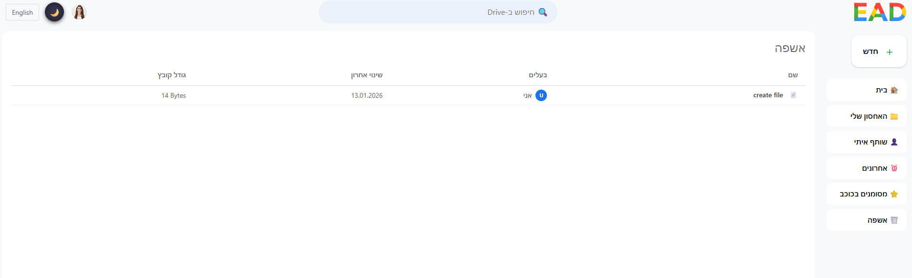 

 - here you can see the files you deleted.

##                                           upload picture

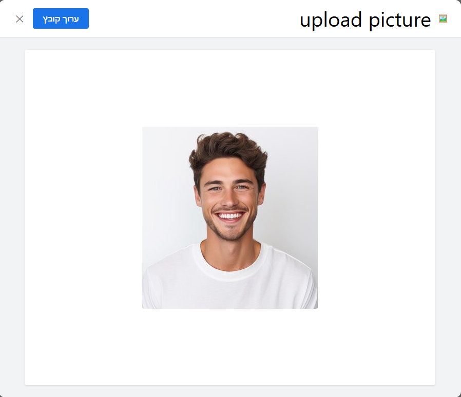 

##                                           edit file

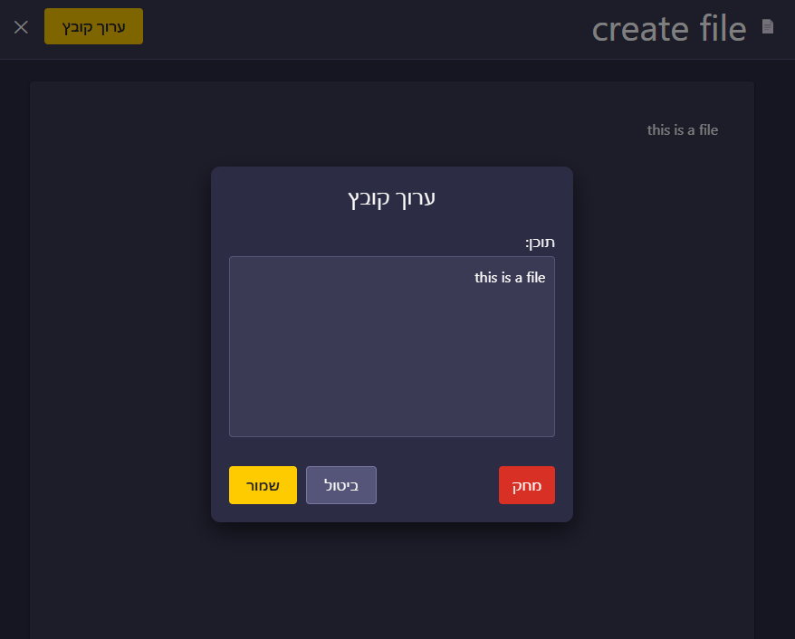 

- for file - allows editing the content

- for image - allows uploading different image

##                                           user details on homepage

 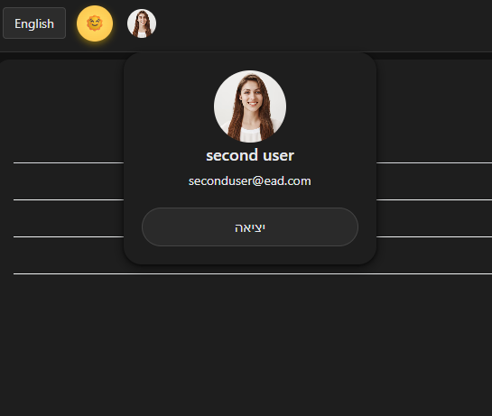 

---------------------------------------------------------------------------------------------------------------------------

## File Structure 📁

- AddCommand.h / AddCommand.cpp : defines the AddCommand class

- GetCommand.h / GetCommand.cpp : defines the GetCommand class

- SearchCommand.h / SearchCommand.cpp : defines the SearchCommand class

- deletecommand.h / deletecommand.cpp : defines the deletecommand class

- CommandManager.h / CommandManager.cpp : manages all the commands

- CommandFactory.cpp / CommandFactory.h : registers different command objects with a CommandManager so they can be executed by name at runtime.

- ConsoleCommunication.cpp / ConsoleCommunication.h : a class that reads input from the console and writes output to it.

- ICommand.cpp / ICommand.h : base interface for all commands

- Config.h : This header file defines constant strings for command names and corresponding response messages.

- Compressor.h / Compressor.cpp : does RLE compression and decompression

- Parser.cpp / Parser.h : extracts the command, arguments, and query from an input line, validates the input, and handles special cases

- tcp_c.cpp : a client implemented in CPP

- TCP_Client.py : a client implemented in Python

- CMakeLists.txt : creates the executables for tests

- docker-compose.yml/ dockerfiles for server/clients : Docker configuration files for building and running the server and client containers.

- RealServer.cpp : TCP server handling multiple client connections and processing commands.

- handleClient.cpp/HandleClient.h : responsible to handle the clients

- TCPserverCommunication.cpp / TCPserverCommunication.h : responsible for the communication with the sockets

- ICommunication.h: Interface for all communication classes

- threadpool.cpp / threadpool.h: Manages a pool of worker threads that execute tasks concurrently.

- Itask.h: Defines the interface for a task handling communication with a single client.

- ClientTask.cpp / ClientTask.h: Implements a client-handling task with socket, command manager, mutex, and server communication.

- FilesSocketJS.cpp: Handles communication between the C++ server and the JavaScript server.

Controllers:

- files.js – Handles creating, retrieving, updating, and deleting files/folders.

- users.js – Handles user registration, login, and user info retrieval. when login, creates JWT for the user.

- permissions.js – Handles creating, updating, deleting, and retrieving file/folder permissions.

- search.js - Fetches files matching the query from TCP server and local user files, returns combined list

Models:

- files.js – Stores and manages file/folder data in memory.

- users.js – Stores and manages user data in memory.

- permissions.js – Stores and manages permissions for files/folders.

Routes:

- files.js – Defines HTTP routes for file/folder operations, connects to files.js controller.

- users.js – Defines HTTP routes for user operations, connects to users.js controller.

- permissions.js – Defines HTTP routes for permission operations, connects to permissions.js controller.

- search.js - Search files by query

##      React files

React Components

- login/login.jsx / login/login.css – Component for the login page; handles user input, validation, and sending login requests to the backend. Styles the login form.

- Register/Register.jsx / Register/Register.css / Register/Button.jsx – Component for the registration page; handles user registration input, validation, and submission. Button.jsx is a reusable styled button used in the registration form.

- CreateFileForm.jsx / CreateFileForm.css – Form component to create a new file or folder; handles input validation and form submission. CSS styles the form.

- emailPrompt.jsx / emailPrompt.css – Modal component that prompts the user to enter an email (e.g., for sharing files); CSS styles the modal.

- FileItem.jsx / fileItem.css – Component for displaying a single file or folder item in a list or table; handles events like click, double-click, and right-click. CSS styles the item.

- FileRightClickMenu.jsx – Context menu that appears when right-clicking a file item; allows actions like rename, delete, share.

- FileTable.jsx / FileTable.css – Table component that displays a list of files and folders using FileItem components; handles sorting and selection. CSS styles the table.

- LangButton.jsx – Button component to switch language in the UI; interacts with LangContext.

- Layout.jsx / Layout.css – Main layout component for pages; includes header, sidebar, and main content area. CSS styles the overall layout.

- modalMoveToFolder.css / MoveFolderModal.jsx – Modal component to move a file/folder to another folder; CSS styles the modal.

- ProfilePic.jsx – Component to display and manage the user’s profile picture; may include upload functionality.

- RequireAuth.jsx – Wrapper component to protect routes; checks if user is authenticated and redirects if not.

- TextInput.jsx – Reusable input component with custom styling and optional validation.

## Context

- LangContext.jsx – React context that manages the current language for the app and provides functions to switch languages across components.

## Pages

- BinPage.jsx – Page displaying deleted files (Recycle Bin); allows restore or permanent deletion.

- EditFileForm.jsx – Page/modal to edit file or folder properties (like name); handles input validation and submission.

- FileView.jsx / FileView.css – Page displaying a single file’s content; may allow editing or preview. CSS styles the view.

- FolderView.jsx / FolderView.css – Page displaying folder contents as a grid or list; allows navigation into subfolders. CSS styles the view.

- Home.jsx / Home.css – Main dashboard page showing user files and folders; may include recent files, starred files, etc. CSS styles the dashboard.

- MyDrive.jsx – Page representing the user’s personal drive; shows all owned files and folders.

- Recent.jsx – Page listing recently accessed or modified files.

- ShareWithMe.jsx – Page showing files/folders shared with the user.

- StarredFiles.jsx – Page showing files/folders marked as starred/favorites.

API / Utilities

- api/files.js – Contains functions to call backend endpoints for file operations (CRUD, share, move).

- utils/tokenUtils.js – Utility functions for handling JWTs (e.g., get user ID, check if logged in).

- Images / Uploads

- images/ – Static images used in the app (e.g., logos, icons).

- uploads/ – Default uploaded files for the user or placeholder images.

- Secondary React Project (react_project)

- components/left_side_bar.jsx – Sidebar component with navigation links or actions.

- components/up_side_bar.jsx – Top bar component with actions like logout, search, or language switch.

- react_uploads/ – Folder storing images uploaded through this secondary React project.

- App.js / App.css / index.js / index.css – Main app entry points; setup routing, providers, global styles, and renders the root component.

- node_server.js – Node server for serving this React app (if applicable).

- package.json / package-lock.json – Defines dependencies (like jwt-decode), scripts, and project metadata.

## Authors ✍️

- Dvir Tabib
- Eylon Hakak
- Ariel Golod

