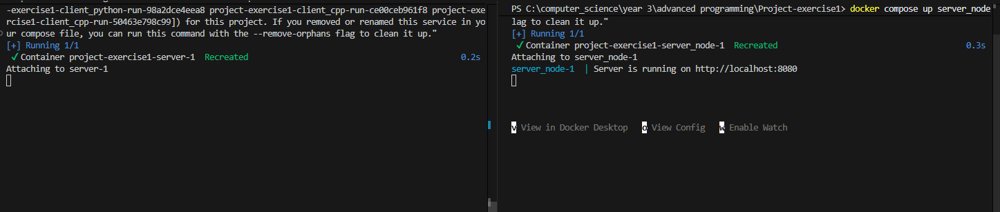

# Project-exercise3 
# AdvancedProgrammingProject-exercise-3 📝

This is the third task out of a full google drive clone project.

## Key functionalities 📂

- User Accounts: Create a new user with an email, password, and profile image. Includes a login system to verify users.

- File & Folder Management: Create files with content or folders to stay organized. 

- Permissions Control: Share your files with other users. You can give "read" or "write" access, see who has permission, and change or delete those permissions whenever you want.

- File Operations: Full support for editing file content (PATCH) and deleting files or folders you don't need anymore.

- Search System: find what you're looking for by searching for a query. It checks both the names of the files and the text inside them.

- Dual-Server Setup: Uses a C++ server for file operations and a Node.js web server to handle API requests, all running together via Docker.


## Setup 🛠️

1. Clone the repository - https://github.com/Ariel2001a/Project-exercise1/tree/EX3

      - each task has its own branch - EX1, EX2, EX3...

2. Make sure u have c++17 compiler
3. 
    * run the cpp server 
       
       -  docker compose build
       -  docker compose up server


   * run web server (seperated terminal)
       - docker compose up server_node
       


## Usage 💻 (Linux commands)

- Create new user

curl -i -X POST http://localhost:8080/api/users \
-H "Content-Type: application/json" \
-d '{"first_name":"first","last_name":"user","email":"first@gmail.com","password":"first","image":"first.png"}'

---------------------------------------------------------------------------------------------------------------------------

- Get user's details

curl -i -X GET http://localhost:8080/api/users/1

---------------------------------------------------------------------------------------------------------------------------

- Verifies user exists

curl -i -X POST http://localhost:8080/api/users/tokens \
-H "Content-Type: application/json" \
-d '{"email":"first@gmail.com","password":"first"}'

---------------------------------------------------------------------------------------------------------------------------

- Get all top-leveL files for user 

curl -i -X GET http://localhost:8080/api/files \
-H "user-id: 1"

---------------------------------------------------------------------------------------------------------------------------

- Create new file/folder

curl -i -X POST http://localhost:8080/api/files \
-H "Content-Type: application/json" \
-H "user-id: 1" \
-d '{
  "name": "notes.txt",
  "type": "file", / "folder"
  "content": "hello world", (for folder creation content must be NULL)
  "parentId": null / "folder id"
}'

---------------------------------------------------------------------------------------------------------------------------

- gives the details of the file/folder whose identifier is id.

curl -i -X GET http://localhost:8080/api/files/1  \
  -H "user-id: 1"

---------------------------------------------------------------------------------------------------------------------------

- Edits file or folder 

curl -i -X PATCH http://localhost:8080/api/files/2 \
-H "Content-Type: application/json" \
-H "user-id: 1" \
-d '{
  "name": "notes.txt",
  "content": "this content was updated via PATCH",
   "parentId": null / "folder id"
}'

---------------------------------------------------------------------------------------------------------------------------

- Deletes file or folder

curl -i -X DELETE http://localhost:8080/api/files/1 \
  -H "user-id: 1"

---------------------------------------------------------------------------------------------------------------------------

- Show all permissions for a file

curl -i http://localhost:8080/api/files/1/permissions \
  -H "user-id: 1"

---------------------------------------------------------------------------------------------------------------------------

- Gives permission to a user

curl -i -X POST http://localhost:8080/api/files/2/permissions \
  -H "Content-Type: application/json" \
  -H "user-id: 1" \
  -d '{"userId":2,"permission":"read"}'

---------------------------------------------------------------------------------------------------------------------------

- Update permission by PID

    curl -i -X PATCH http://localhost:8080/api/files/1/permissions/1766845870132 \
  -H "Content-Type: application/json" \
  -H "user-id: 1" \
  -d '{"permission":"write"}'

---------------------------------------------------------------------------------------------------------------------------

- Deletes a permission from a file by PID

   curl -i -X DELETE http://localhost:8080/api/files/1/permissions/1766866323404 \
 -H "user-id: 1"

---------------------------------------------------------------------------------------------------------------------------

- get the files/folders containing the query in their name or content

curl -i -X GET http://localhost:8080/api/search/PATCH \
  -H "user-id: 1"


Dependencies

- c++17 standard library
 
## Run example 🏃‍♂️


##                                                     create first user
```
oject-exercise1 (EX3)
$ curl -i -X POST http://localhost:8080/api/users \
-H "Content-Type: application/json" \
-d '{"first_name":"first","last_name":"user","email":"first@gmail.com","password":"first","image":"first.png"}'
HTTP/1.1 201 Created
```

{"id":1}


##                                                     create second user
```
$ curl -i -X POST http://localhost:8080/api/users -H "Content-Type: application/json" -d '{"first_name":"second","last_name":"user","email":"second@gmail.com","password":"second","image":"second.png"}'
HTTP/1.1 201 Created
```

{"id":2}

##                                                    get first user's details


```
$ curl -i -X GET http://localhost:8080/api/users/1
HTTP/1.1 200 OK
```

{"id":1,"first_name":"first","last_name":"user","email":"first@gmail.com","image":"first.png"}


##                                                     verify first user exists


```
$ curl -i -X POST http://localhost:8080/api/users/tokens \
-H "Content-Type: application/json" \
-d '{"email":"first@gmail.com","password":"first"}'
HTTP/1.1 200 OK
```


{"id":1}


##                                                     create folder for first user


```
$ curl -i -X POST http://localhost:8080/api/files \
-H "Content-Type: application/json" \
-H "user-id: 1" \
-d '{

  "name": "documents",
  "type": "folder",
  "parentId": null
}'
HTTP/1.1 201 Created
```


{"id":1}


##                                                     create file for first user

```
curl -i -X POST http://localhost:8080/api/files \
-H "Content-Type: application/json" \
-H "user-id: 1" \
-d '{
  "name": "notes.txt",
  "type": "file",
  "content": "hello world",
  "parentId": null
}'
HTTP/1.1 201 Created
```


{"id":2}

##                                                    get the file's (id=2) details


```
$ curl -i -X GET http://localhost:8080/api/files/2  \
  -H "user-id: 1"
HTTP/1.1 200 OK
```

{"file":{"id":1,"name":"notes.txt","type":"file","date":1766860463612,"folderParent":null}}


##                                                     get first user's top level files

```
$ curl -i -X GET http://localhost:8080/api/files \
-H "user-id: 1"
HTTP/1.1 200 OK
```

{"files":[{"id":1,"name":"documents","type":"folder","date":1766845753965,"folderParent":null},{"id":2,"name":"notes.txt","type":"file","date":1766845772519,"folderParent":null}]}


##                                                     give second user read permission for the first user's file(id=2)

```
$ curl -i -X POST http://localhost:8080/api/files/2/permissions \
  -H "Content-Type: application/json" \
  -H "user-id: 1" \
  -d '{"userId":2,"permission":"read"}'
HTTP/1.1 201 Created
```

{"id":1766845870132,"userId":2,"fileId":2,"permission":"read"}

##                                                     check file's permissions

```
$ curl -i http://localhost:8080/api/files/2/permissions \
  -H "user-id: 1"
HTTP/1.1 200 OK
```

[{"id":1766845772519,"userId":1,"fileId":2,"permission":"read"},{"id":1766845772519,"userId":1,"fileId":2,"permission":"write"},{"id":1766845772519,"userId":1,"fileId":2,"permission":"owner"},{"id":1766845870132,"userId":2,"fileId":2,"permission":"read"}]


##                                                     change second user permission from read to write

```
    curl -i -X PATCH http://localhost:8080/api/files/1/permissions/1766845870132 \
  -H "Content-Type: application/json" \
  -H "user-id: 1" \
  -d '{"permission":"write"}'
HTTP/1.1 200 OK
```

{"id":1766845870132,"userId":2,"fileId":2,"permission":"write"}


##                                                     check file's permissions

```
$ curl -i http://localhost:8080/api/files/2/permissions   -H "user-id: 1"
HTTP/1.1 200 OK
```

[{"id":1766845772519,"userId":1,"fileId":2,"permission":"read"},{"id":1766845772519,"userId":1,"fileId":2,"permission":"write"},{"id":1766845772519,"userId":1,"fileId":2,"permission":"owner"},{"id":1766845870132,"userId":2,"fileId":2,"permission":"write"}]


##                                                     delete second user's permission

```
$   curl -i -X DELETE http://localhost:8080/api/files/2/permissions/1766845870132 \
 -H "user-id: 1"
HTTP/1.1 204 No Content
```


##                                                     check file permissions again

```
$ curl -i http://localhost:8080/api/files/2/permissions \
  -H "user-id: 1"
HTTP/1.1 200 OK
```

[{"id":1766845772519,"userId":1,"fileId":2,"permission":"read"},{"id":1766845772519,"userId":1,"fileId":2,"permission":"write"},{"id":1766845772519,"userId":1,"fileId":2,"permission":"owner"}]


##                                                     change the content and name of the file

```
$ curl -i -X PATCH http://localhost:8080/api/files/2 \
-H "Content-Type: application/json" \
-H "user-id: 1" \
-d '{
  "name": "notes.txt",
  "content": "this content was updated via PATCH",
  "parentId": null
}'
HTTP/1.1 204 No Content
```

##                                                     delete the folder

```
$ curl -i -X DELETE http://localhost:8080/api/files/1 \
  -H "user-id: 1"
HTTP/1.1 204 No Content
```

##                                                     search for 'PATCH' in first user's files

```
curl -i -X GET http://localhost:8080/api/search/PATCH \
  -H "user-id: 1"
HTTP/1.1 200 OK
```

{"filesList":[{"id":2,"name":"notes.txt","type":"file","date":1766845772519,"folderParent":null,"content":"this content was updated via PATCH"}]}


##                                                     get first user's top level files

```
$ curl -i -X GET http://localhost:8080/api/files \
-H "user-id: 1"
HTTP/1.1 200 OK
```

{"files":[{"id":2,"name":"notes.txt","type":"file","date":1766845772519,"folderParent":null,"content":"this content was updated via PATCH"}]}


---------------------------------------------------------------------------------------------------------------------------

## servers running 📡 📤

--  --


## File Structure 📁


- AddCommand.h / AddCommand.cpp : defines the AddCommand class

- GetCommand.h / GetCommand.cpp : defines the GetCommand class

- SearchCommand.h / SearchCommand.cpp : defines the SearchCommand class

- deletecommand.h / deletecommand.cpp : defines the deletecommand class

- CommandManager.h / CommandManager.cpp : manages all the commands

- CommandFactory.cpp / CommandFactory.h : registers different command objects with a CommandManager so they can be executed by name at runtime.

- ConsoleCommunication.cpp / ConsoleCommunication.h : a class that reads input from the console and writes output to it.

- ICommand.cpp / ICommand.h : base interface for all commands

- Config.h : This header file defines constant strings for command names and corresponding response messages.

- Compressor.h / Compressor.cpp : does RLE compression and decompression

- Parser.cpp / Parser.h : extracts the command, arguments, and query from an input line, validates the input, and handles special cases

- tcp_c.cpp : a client implemented in CPP

- TCP_Client.py : a client implemented in Python

- CMakeLists.txt : creates the executables for tests

- docker-compose.yml/ dockerfiles for server/clients : Docker configuration files for building and running the server and client containers.

- RealServer.cpp : TCP server handling multiple client connections and processing commands.

- handleClient.cpp/HandleClient.h : responsible to handle the clients

- TCPserverCommunication.cpp / TCPserverCommunication.h : responsible for the communication with the sockets

- ICommunication.h: Interface for all communication classes

- threadpool.cpp / threadpool.h: Manages a pool of worker threads that execute tasks concurrently.

- Itask.h: Defines the interface for a task handling communication with a single client.

- ClientTask.cpp / ClientTask.h: Implements a client-handling task with socket, command manager, mutex, and server communication.

- FilesSocketJS.cpp: Handles communication between the C++ server and the JavaScript server.


Controllers:

- files.js – Handles creating, retrieving, updating, and deleting files/folders.

- users.js – Handles user registration, login, and user info retrieval.

- permissions.js – Handles creating, updating, deleting, and retrieving file/folder permissions.

- search.js - Fetches files matching the query from TCP server and local user files, returns combined list

Models:

- files.js – Stores and manages file/folder data in memory.

- users.js – Stores and manages user data in memory.

- permissions.js – Stores and manages permissions for files/folders.


Routes:

- files.js – Defines HTTP routes for file/folder operations, connects to files.js controller.

- users.js – Defines HTTP routes for user operations, connects to users.js controller.

- permissions.js – Defines HTTP routes for permission operations, connects to permissions.js controller.

- search.js - Search files by query


## Authors ✍️

- Eylon Hakak
- Ariel Golod
- Dvir Tabib
