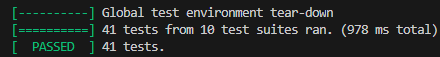
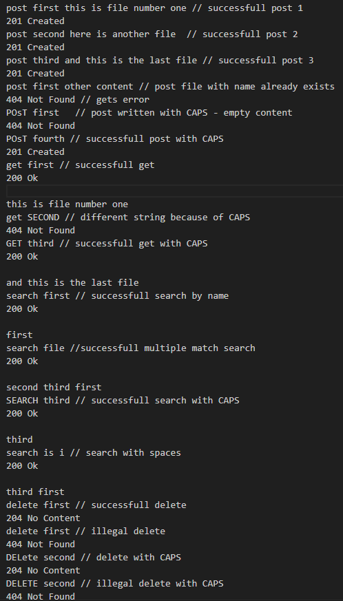
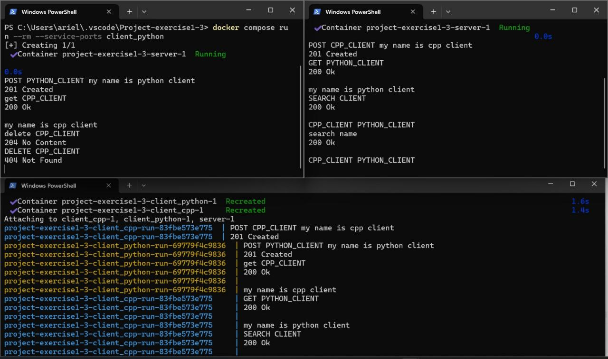
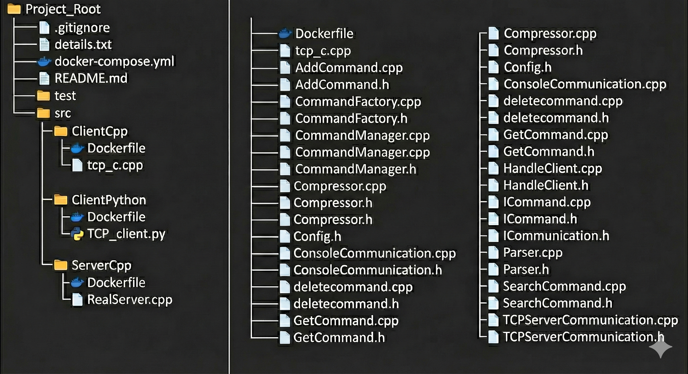

# Project-exercise2 
# AdvancedProgrammingProject-exercise-2 📝

This is the second task out of a full google drive clone project.

## Key functionalities 📂
- Post command : Gets file name and content. compress the file using RLE compression and adds it to a folder using enviroment variable
- Get command : Gets file name. find the file in the folder, decompress it and return it
- Search command : Gets a text query. search for files containing the query or has the query in the name and return a list of file names
- Delete command : Gets a file name. finds it in the folder and deletes it.
- TCP-based clients and server : supporting data transmission and multi-client connections.

## Setup 🛠️

1. Clone the repository - https://github.com/Ariel2001a/Project-exercise1/tree/EX2
2. Make sure u have c++17 compiler
3. 
    * run the server 
       
       -  docker compose build
       -  docker compose up

   * run clients (seperated terminals)
       - docker compose run --rm --service-ports client_cpp
       - docker compose run --rm --service-ports client_python

##  Testing ✅
Tests are written using GoogleTest.  
Test cover:
* Post command tests - test file RLE compression, Test command validity.
* Get command tests - file creation test, folder creation test .
* Search command tests - single match, no match and multiple match tests. 
* Delete command tests - simple delete for successfull delete and illegal delete for an attempt to delete a file that do not exist.
* Sockets tests - These tests verify that the server correctly accepts clients, handles multiple clients in order, and properly manages cases where some client connections fail.

## Tests - clean destination folder and run 🧹

     1. cd test
     2. docker compose run --rm tests bash
     3. ls /usr/src/app/newFiles
     4. rm -f /usr/src/app/newFiles/*
     5. exit
     6. docker compose build
     7. docker compose run --rm tests ./runTests

## Usage 💻

-POST [File name] [File content]

-Get [File name] 

-Search [Your Query]

-Delete [File name]

Dependencies

- c++17 standard library
 
## Run example 🏃‍♂️

--  --

## clients and servers running examples 📡 📤

--  --

## File Structure 📁

--  --

- AddCommand.h / AddCommand.cpp : defines the AddCommand class

- GetCommand.h / GetCommand.cpp : defines the GetCommand class

- SearchCommand.h / SearchCommand.cpp : defines the SearchCommand class

- deletecommand.h / deletecommand.cpp : defines the deletecommand class

- CommandManager.h / CommandManager.cpp : manages all the commands

- CommandFactory.cpp / CommandFactory.h : registers different command objects with a CommandManager so they can be executed by name at runtime.

- ConsoleCommunication.cpp / ConsoleCommunication.h : a class that reads input from the console and writes output to it.

- ICommand.cpp / ICommand.h : base interface for all commands

- Config.h : This header file defines constant strings for command names and corresponding response messages.

- Compressor.h / Compressor.cpp : does RLE compression and decompression

- Parser.cpp / Parser.h : extracts the command, arguments, and query from an input line, validates the input, and handles special cases

- tcp_c.cpp : a client implemented in CPP

- TCP_Client.py : a client implemented in Python

- CMakeLists.txt : creates the executables for tests

- docker-compose.yml/ dockerfiles for server/clients : Docker configuration files for building and running the server and client containers.

- RealServer.cpp : TCP server handling multiple client connections and processing commands.

- handleClient.cpp/HandleClient.h : responsible to handle the clients

- TCPserverCommunication.cpp / TCPserverCommunication.h : responsible for the communication with the sockets

- ICommunication.h: Interface for all communication classes

- test.cpp / docker-compose.yml(for tests) : tests to check codes functionallity

 

## Task questions ❓

## Did changing the command names require modifying code that was supposed to be “closed for modification but open for extension”?

Initially — no significant modifications were required.
Each command class (e.g., AddCommand) inherits from the ICommand interface, and in the first implementation the command’s name was provided through the constructor of the command class itself.
Therefore, changing the name of a single command only required updating the constructor of that specific class, without affecting any shared logic or infrastructure.

However, although this worked for a single change, it exposed a structural weakness:
if multiple command names were to change, we would need to open every command class individually and update the constructor in each one.
This results in multiple modifications across many files, which violates the Open/Closed Principle (OCP) and increases the coupling of the system.

Refactoring to avoid this issue in the future

To prevent this problem in future assignments, we redesigned the system:

- The constructor of ICommand was changed to a default constructor and no longer receives the command name.

- We introduced a dedicated component, CommandFactory, whose responsibility is to instantiate commands and    associate them with their names.

- The CommandManager maintains a map of command names to command objects.

- Command names themselves were centralized into a single configuration file (config.h) as constants (#define).

Result

This redesign ensures that if a command name changes in the future, the only modification required is updating the constant in config.h.
No command classes need to be opened, no logic is modified, and the system now adheres properly to OCP.

## Did adding new commands require modifying code that was supposed to be “closed for modification but open for extension”?

No.
As explained in the previous section, all commands inherit from the ICommand interface and are instantiated through the CommandFactory.
Because of this design, adding a new command does not require modifying any existing logic.
To add a new command, we only needed to:

1. Create a new class that inherits from ICommand.

2. Add a single line in the CommandFactory to register the new command with the CommandManager.

This means the system remains closed for modification (no existing components were changed) but open for extension (we extended the system by adding new classes and registry entries).

The CommandFactory was specifically designed to centralize command creation, so modifying it to include new command instances does not violate OCP; adding entries to a factory is considered an extension, not a modification to core logic.

This demonstrates that the architecture supports clean extensibility, as required by the Open/Closed Principle.

## Did the change in output format require modifications to code that should be “closed to modification but open to extension”?

Yes.
In the implementation we wrote for the first exercise, the commands printed their output directly inside the command classes. This design violates the Open/Closed Principle, because any future change in the output format would force us to modify the existing command classes.

To address this and ensure the system remains closed to modification but open to extension, we refactored the design as follows:

1. We created a ConsoleCommunication class
   This class is solely responsible for input and output operations via the console.
   All printing logic was moved out of the command classes and into this communication layer.

2. ConsoleCommunication implements the ICommunication interface
   By introducing this abstraction, we can easily add new communication methods (e.g., TCP communication, file-based communication, GUI output) without changing any existing code—only by adding new classes that implement ICommunication.
3. We modified the signature of ICommand::run so that it returns a string instead of printing directly
   Each command now returns its result as a string.
   The communication layer (e.g., Console or TCP) is responsible for delivering this string to the user.
   This keeps command logic clean and independent of I/O concerns.

4. Output messages were moved to the Config file as #define constants
   This ensures that any future changes to printed texts do not require changes in the logic of the commands themselves.
   Instead, the messages can be updated in a single configuration file.

As a result:

- The command classes no longer require modification for changes in output format

- The system allows for adding new forms of communication without touching existing logic

- The design fully adheres to the Open/Closed Principle

## "Did the fact that input/output comes from sockets instead of the console require you to modify code that was supposed to be 'closed for modification but open for extension'?"

Yes.

As mentioned in previous questions, we created a new interface called ICommunication, which is inherited by all classes responsible for handling communication.

Now, there are two classes that implement this interface:

ConsoleCommunication – handles reading from and writing to the console.

TCPServerCommunication – handles input and output coming from sockets.

This design ensures that in the future, we can add new types of communication without modifying the existing code, keeping the system closed for modification but open for extension.

## Authors ✍️

- Eylon Hakak
- Ariel Golod
- Dvir Tabib