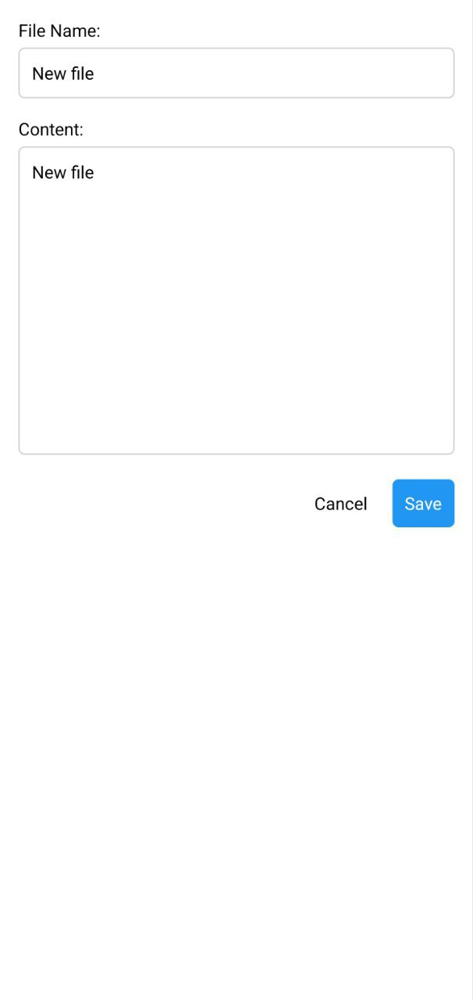
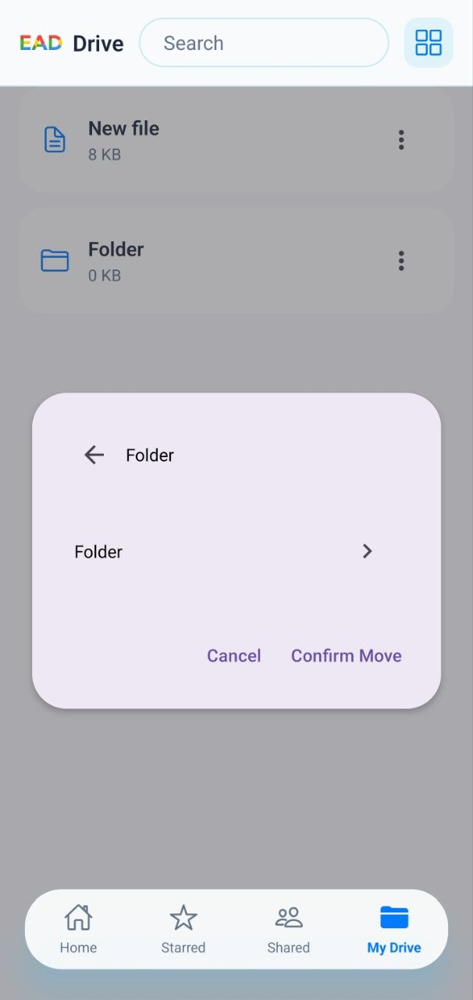
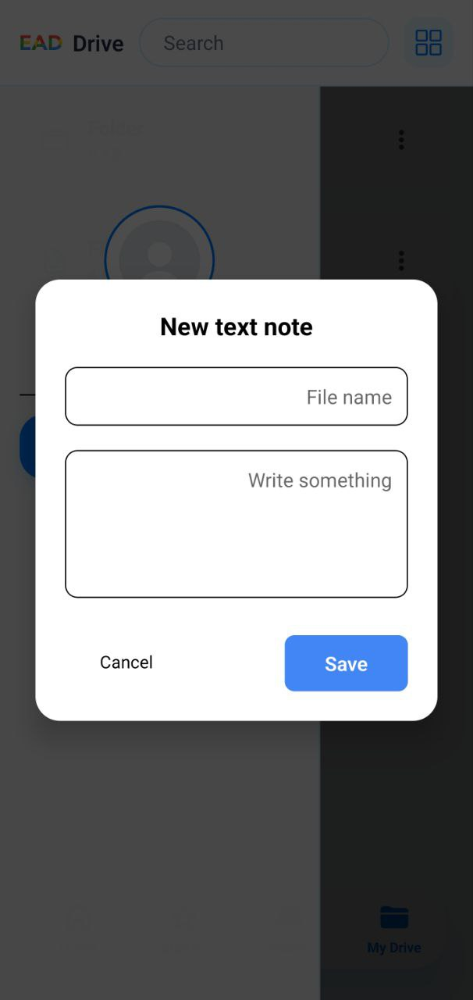
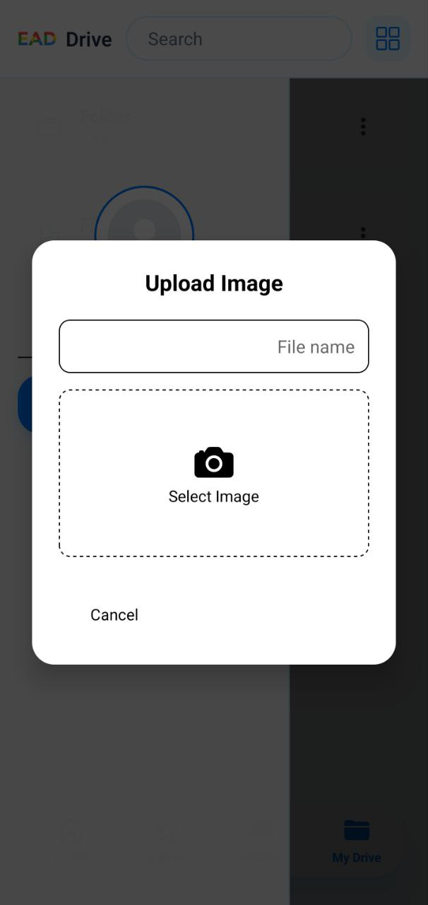
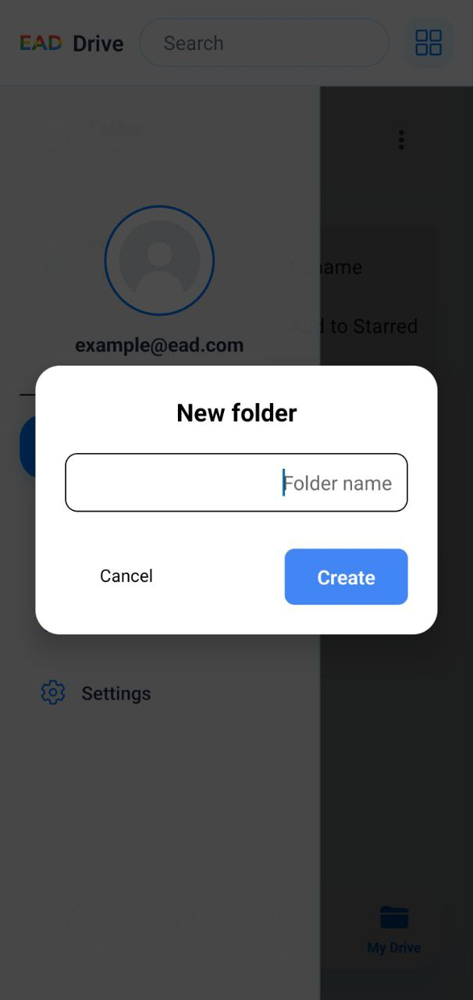

## File Form

  
**File Form** – Used to create a new file. Users can enter the file name and select file type.

## Edit File Form

  
**Edit File Form** – Allows editing the file name or updating its content.

## Picture Form

  
**Picture Form** – Used to upload an image. Users can select a picture from their device and add a title or description.

## Edit Picture Form

  
**Edit Picture Form** – Allows replacing the image or deleting it 

## Move Folder Form

  
**Move Folder Form** – Lets the user select a destination folder to move the file or folder into.

## Share File Form

  
**Share File Form** – Used to share files or folders with other users by entering their email and selecting permissions.

## Create File Form

  
**Create File Form** – Used to create a new file. 

## Create Picture Form

  
**Create Picture Form** – Used to upload a new image. Users can select a picture or use camera to take picture

## Create Folder Form

  
**Create Folder Form** – Used to create a new folder. 
