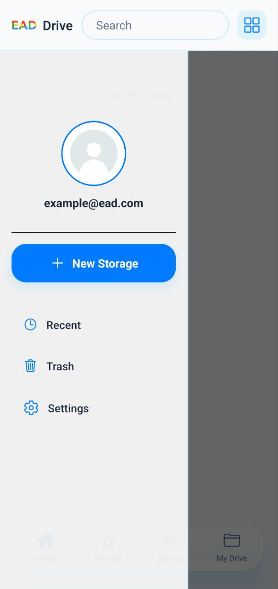
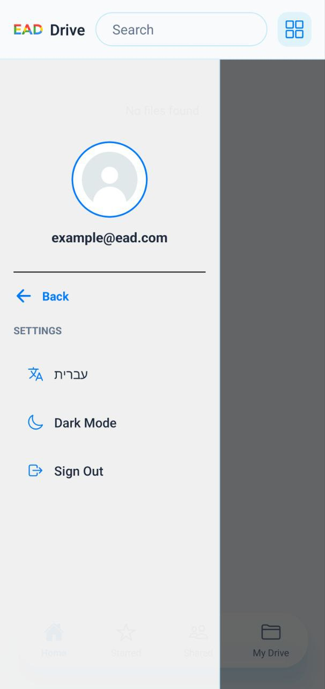
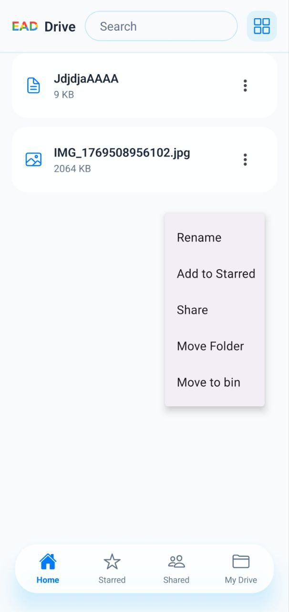
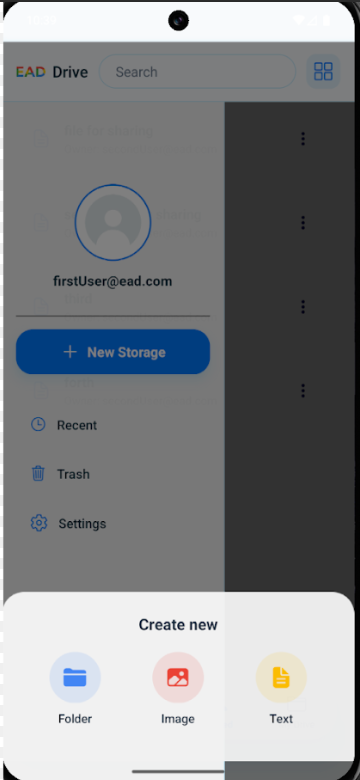
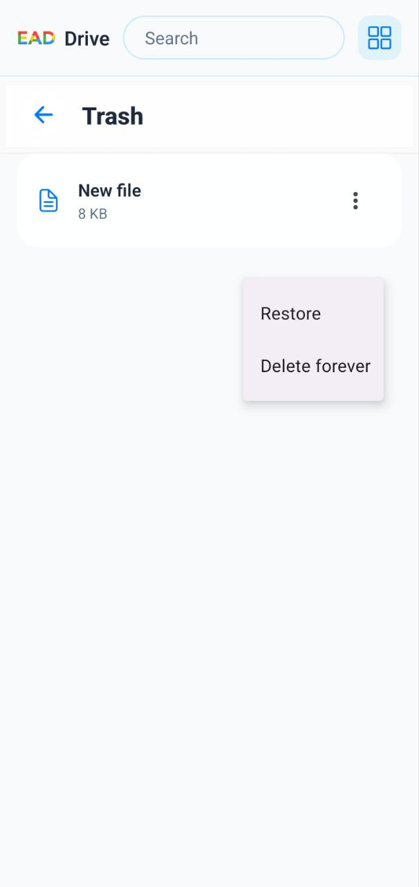
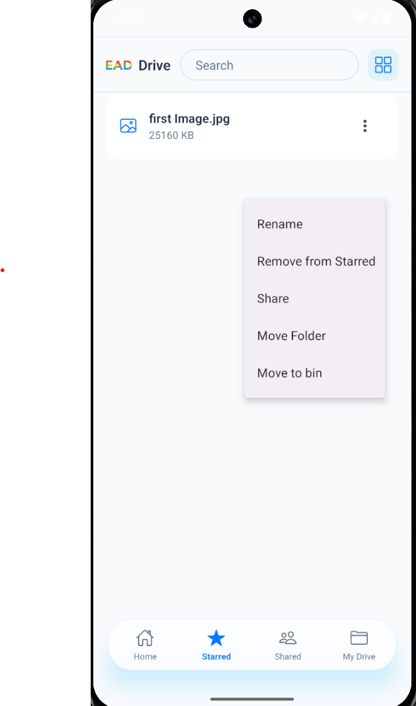
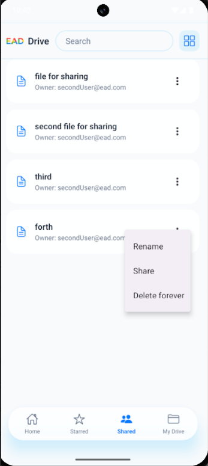
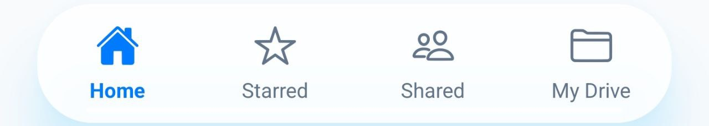

## Side Menu

- It displays the **logged-in user’s profile**, including profile picture and email.
- From the side menu, users can:
  - Create new files or folders using the **New Storage** button.
  - Navigate to **Recent files**.
  - Open the **Bin** to manage deleted items.
  - Access **Settings**, including theme and language preferences.
- The menu is rendered as an overlay and can be closed by tapping outside of it.

## Settings Menu

- The settings menu allows users to customize the application and manage their account.
- Available options include:
  - **Language toggle** – switch between supported languages.
  - **Theme toggle** – switch between Dark and Light mode.
  - **Sign out** – log out from the application and clear stored authentication data.

## Item Options Menu

- The item options menu is accessible via the **three-dot icon** on each file or folder.
- It provides contextual actions depending on the item state (normal view, starred page, or bin).
- Available actions include:
  - **Rename** a file or folder.
  - **Add to / Remove from Starred**.
  - **Share** an item with another user via email.
  - **Move Folder** to a different directory.
  - **Move to Bin** (soft delete).
- When viewing items in the **Bin**, the menu changes to:
  - **Restore** the item.
  - **Delete forever** (permanent deletion).

  ## Choose File Type

- When creating a new file, users can select the **type of file** they want to create.  
- Available file types include:
  - **Text File** – create a standard text file.
  - **Image File** – create a new image 
  - **Folder** – create a new folder to organize files.  

## File Menu in Trash

- The file menu in the Trash is accessed via the **three-dot icon** on deleted items.  
- It provides actions specific to items in the Bin:  
  - **Restore** – move the item back to My Drive.  
  - **Delete Forever** – permanently remove the item from the system.  

## File Menu in Starred

- The file menu in Starred is accessed via the **three-dot icon** on starred items.  
- It provides actions specific to items in the Starred page:  
  - **Remove from Starred** – unmark the item as favorite.  

## File Menu in Shared

- The file menu in the Shared page is accessed via the **three-dot icon** on shared items.  
- It provides actions specific to items shared with the user:
  - **Rename** – change the name of the shared item (if permissions allow).  
  - **Share** – re-share the item with another user.  
  - **Delete Forever** – permanently remove the shared item from the system.

## Top Bar

- The top bar contains a **search input** for finding files and folders.
- It also includes a **button to open the side menu**, giving access to profile, settings, and quick actions.

---

## Bottom Bar

- The bottom bar provides **navigation between main pages**:
  - Home
  - Starred
  - Shared
  - My Drive
- It allows users to quickly switch between sections of the application.
