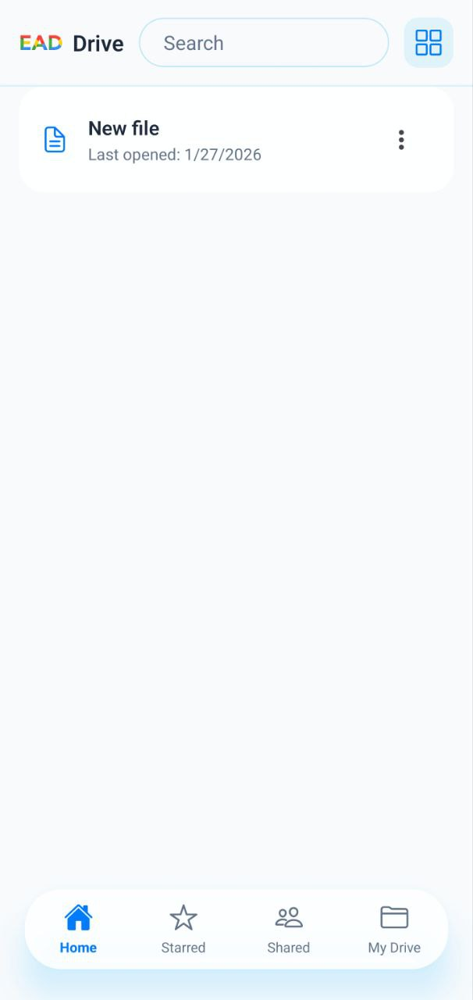
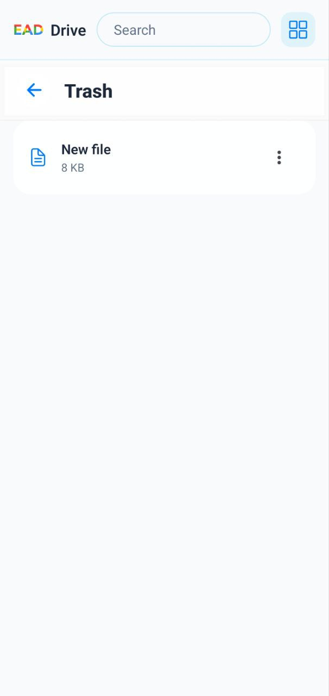
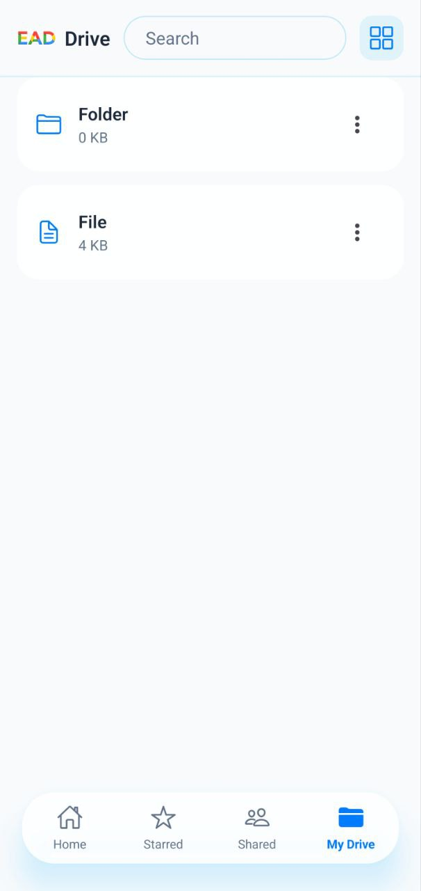
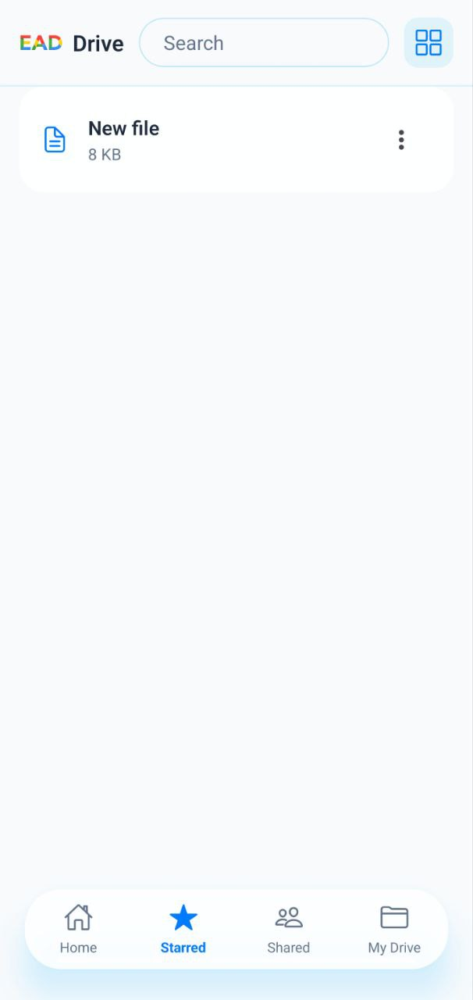
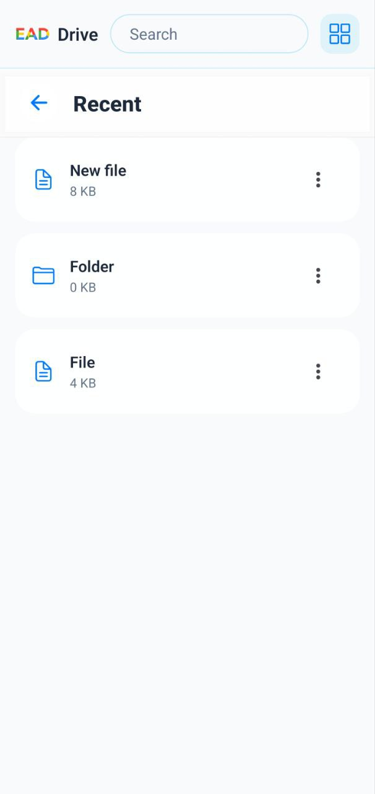

## Home Page

- The Home page serves as the main dashboard of the application.  

---

## Trash Page

- The Bin page displays files and folders that were deleted by the user.  
- Items can be **restored** back to My Drive or **permanently deleted** from the system.

---

## My Drive Page

- My Drive contains all files and folders owned by the user.  

---

## Starred Page

- The Starred page shows files and folders that the user marked as favorites.  
- This allows quick access to frequently used or important items.

---

## Recent Page

- The Recent page displays files and folders that were **recently accessed or modified**.  
- It helps users quickly return to their latest work.

---

## Shared Page

- The Shared page lists files and folders that were **shared with the user** by others.  
- Users can view and interact with shared content based on the permissions granted to them.
