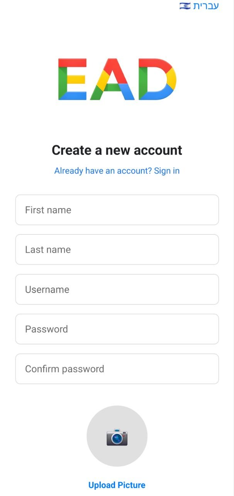
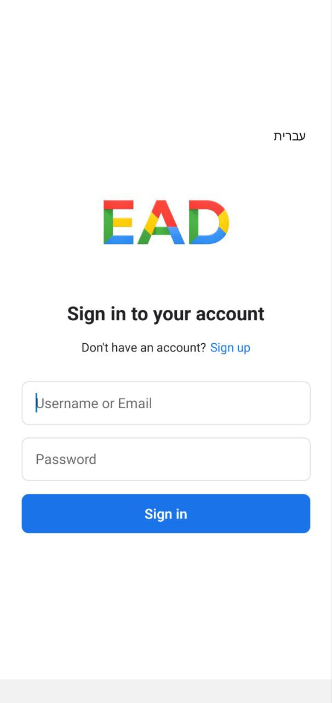

## Registration Screen

- The password must be at least 8 characters long and include both letters and numbers.  
- During registration, users may upload a profile picture or continue with the default profile image.

## Login Screen

- Users can log in using either their username or `username@ead.com`.  
- Upon successful login, a JWT token is created and stored in AsyncStorage.
