## Full Run Example – User Flow

**Step 1:** Register a new user.  

**Step 2:** Log in with the newly created account.  

**Step 3:** Arrive at the Home page.  
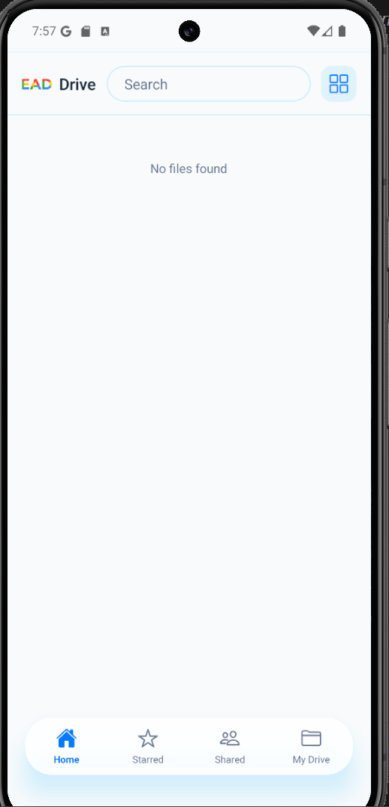

**Step 4:** Open the side menu and create a new folder named **"new folder"**.  
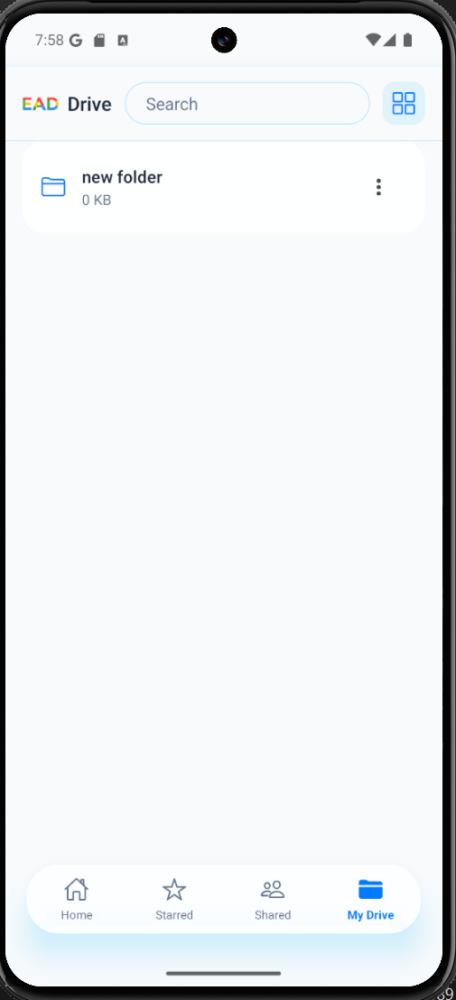

**Step 5:** Enter **"new folder"** and create a new file named **"New file"**.  
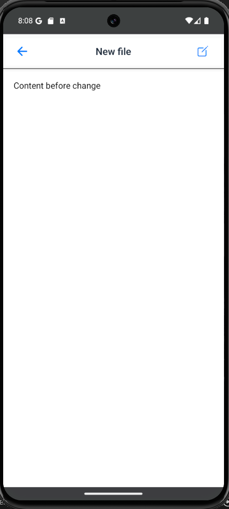

**Step 6:** Edit the content of **"New file"** and save the changes.  
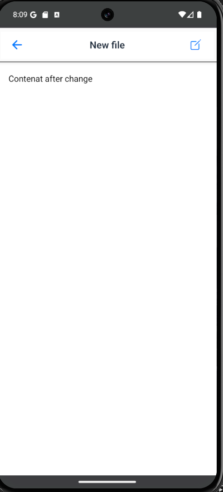

**Step 7:** Create a new image file inside **"new folder"**.  

**Step 8:** Edit the image by replacing or updating the picture.  
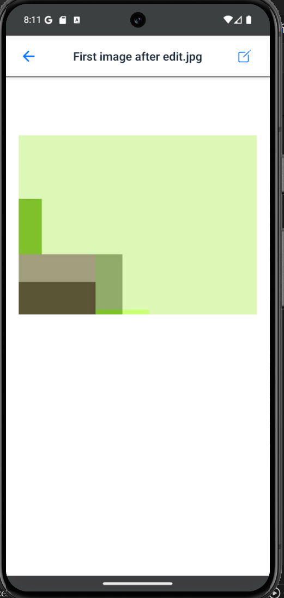

## Rename **"New file"** to **"new name file"**, star it, and share it with another user.  

**Step 9:** Log in with a different user account and verify that the shared file appears in the **Shared** page.  
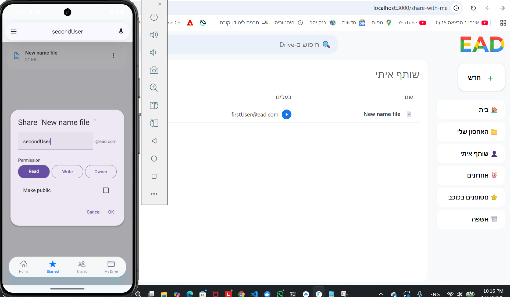

**Step 10:** Open the **Starred** page to verify the file appears as starred.  
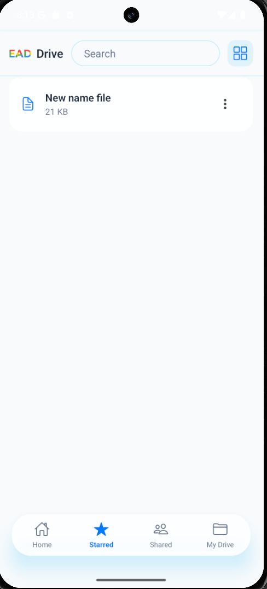

**Step 11:** Delete **"new name file"** (the file is moved to the Bin).  
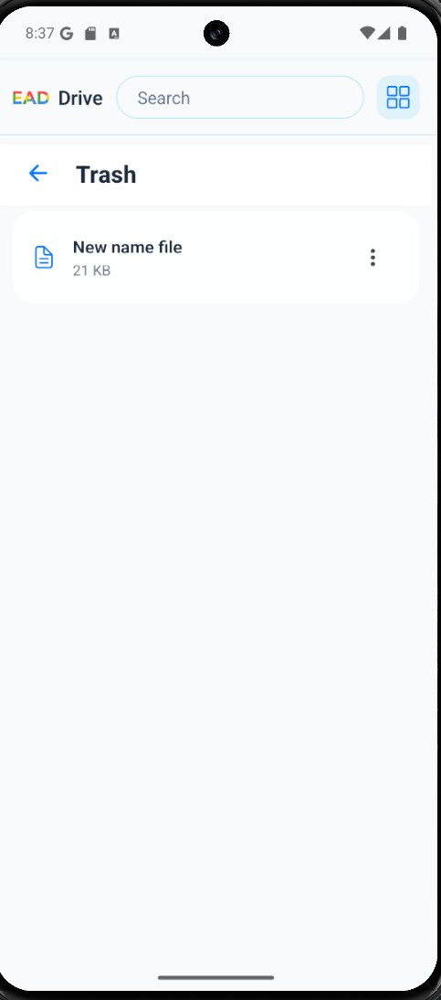

**Step 12:** Open the **Bin** and restore **"new name file"**.  

**Step 13:** Delete **"new name file"** permanently.  
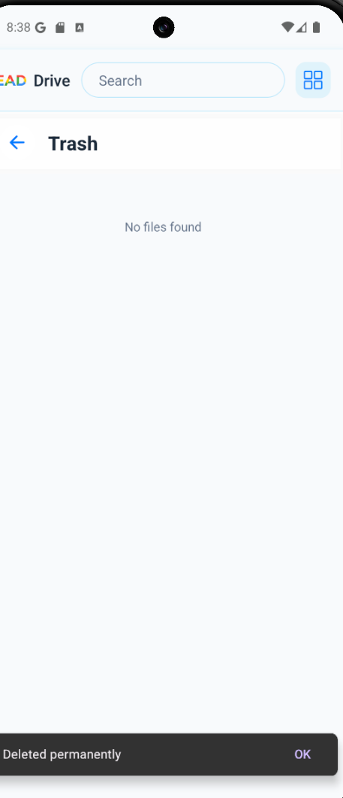

**Step 14:** Open **Settings**, toggle dark mode, change the language.  
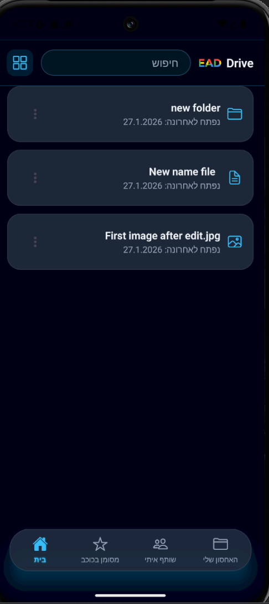

**Step 15:** Open the **Recent** page to review the activity history.  
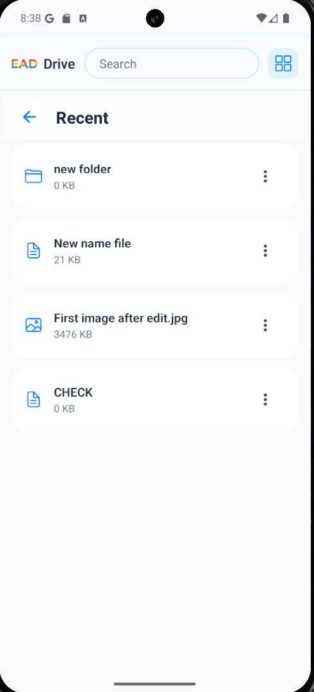
