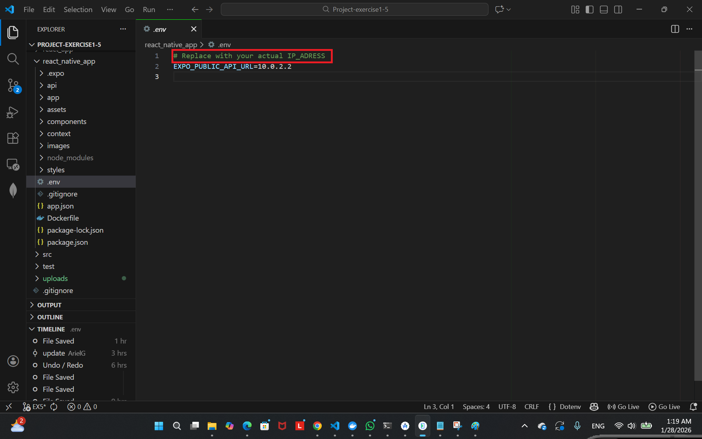
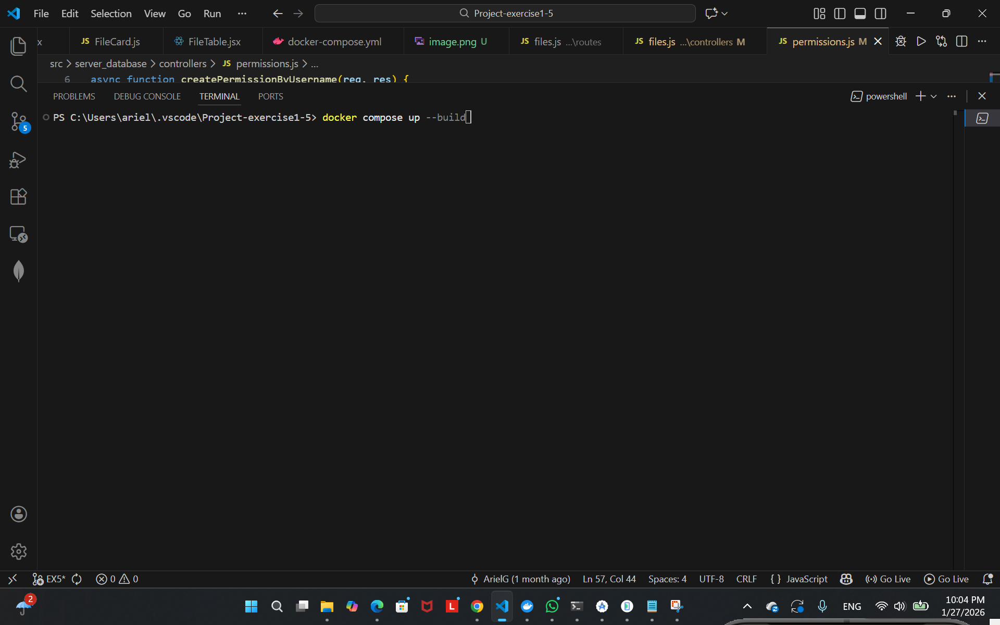
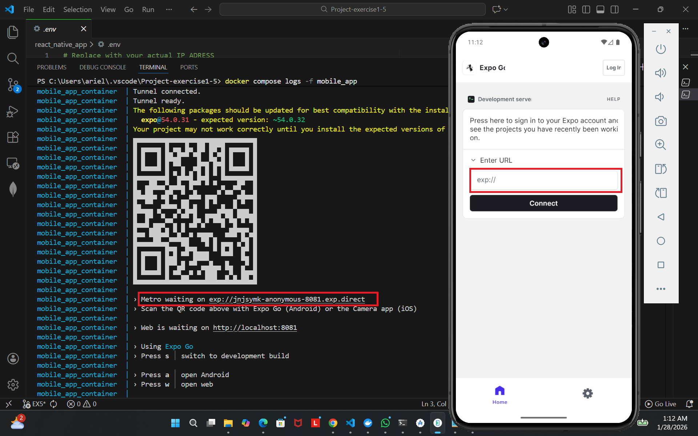
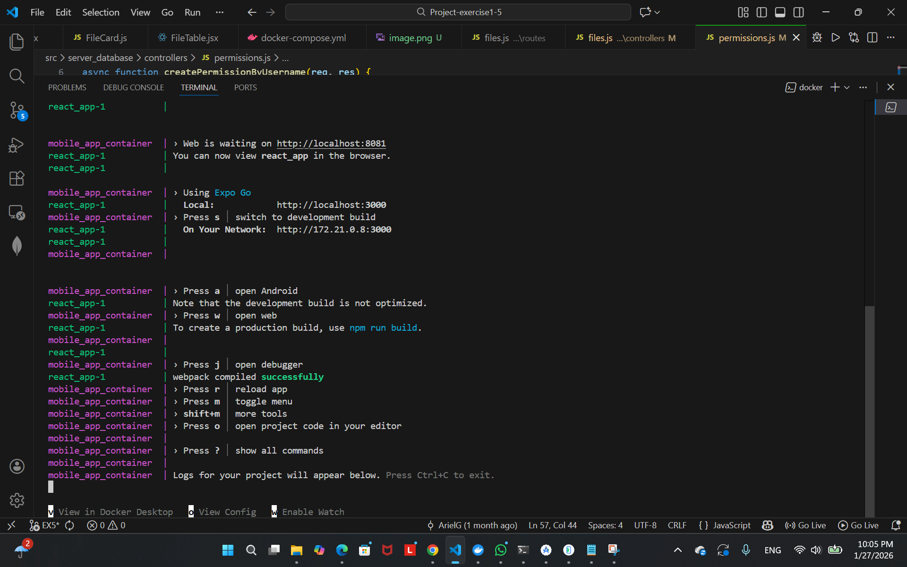
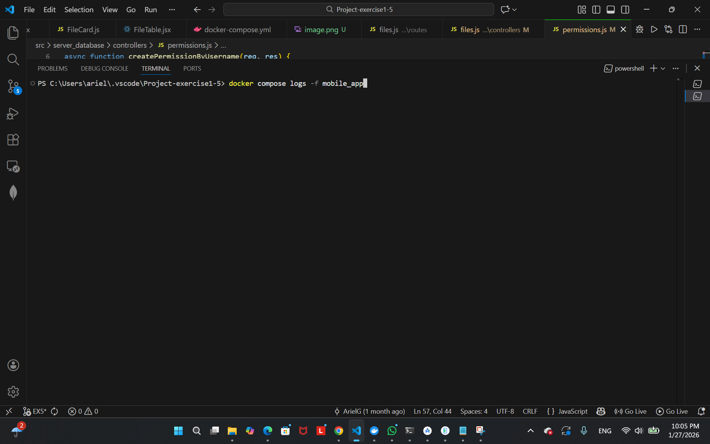

## Setup 🛠️

1. Clone the repository - https://github.com/Ariel2001a/Project-exercise1/tree/EX5

      - each task has its own branch - EX1, EX2, EX3...

2. Make sure u have c++17 compiler

## run in emulator

1. The default IP in the .env file (10.0.2.2) is configured for use with the Android emulator.

2. run the command - docker compose up --build

3. If the URL address does not display correctly,open new terminal and use the following command: docker compose logs -f mobile_app

4. Go to expoGO app inside the emulator, and enter the URL address

5. click connect

## run in seperated device

1. Open CMD and run `ipconfig` to get your IP address.

2. Go to the `.env` file inside the `react_native_app` folder and set your IP there.

3. run the command - docker compose up --build

4. scan the QR code.
    
5. If the QR does not display correctly,open new terminal and use the following command: docker compose logs -f mobile_app

## change the IP in the env file

## run the servers and apps

## Good run

## Barcode does not display correctly

## Fixed with this command

